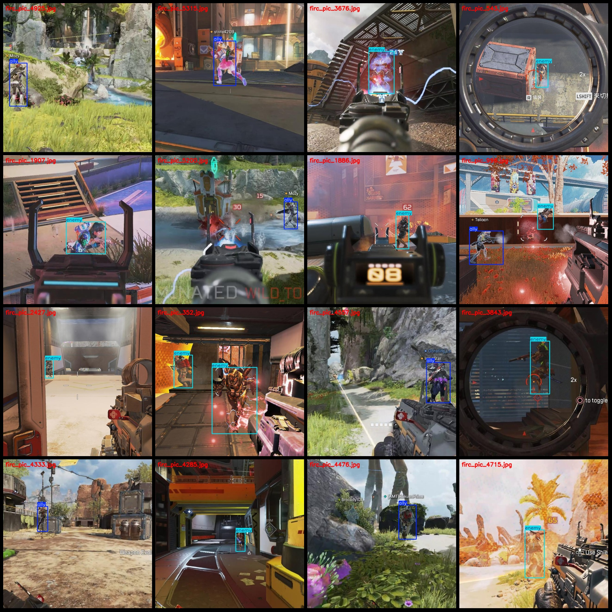
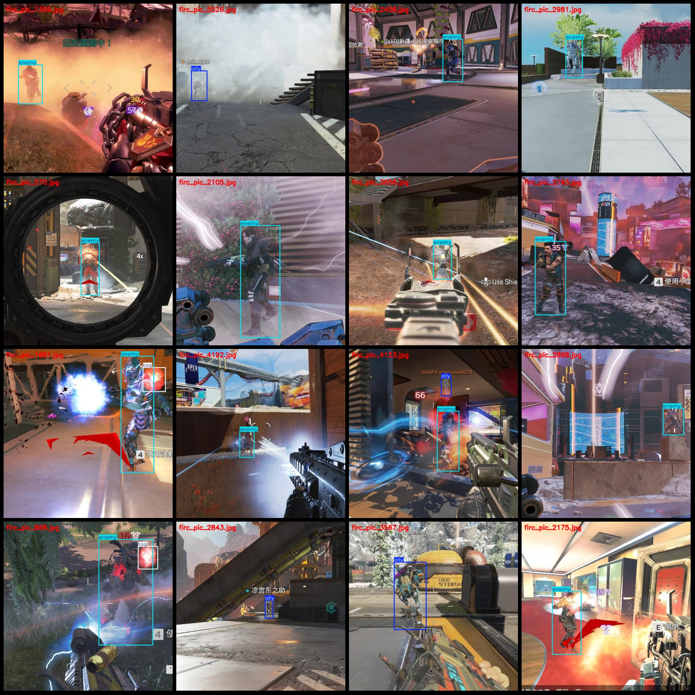

# Apex Detection Data Set for the Game "Apex Legends" - 3-Class Dataset in Pascal VOC+YOLO Format with 5671 Images

Dataset Format: Pascal VOC format + YOLO format (excluding split paths, only containing jpg images along with corresponding VOC format xml files and yolo format txt files)
Number of Images (jpg file count): 5671
Number of Annotations (xml file count): 5671
Number of Annotations (txt file count): 5671
Number of Annotation Categories: 3
Annotation Category Names (Note that the order of categories in the yolo format does not correspond to this, but is based on the labels folder's classes.txt): ["ally", "enemy", "tag"]
Number of Boxes per Category:
- Ally (friendly) boxes = 2704
- Enemy (hostile) boxes = 3722
- Tag (ping markers, death box, keypoint indicators) boxes = 269
Total Boxes: 6695
Number of Images per Category:
- Ally images = 2352
- Enemy images = 3535
- Tag images = 245
Image Resolution: 640x640
Annotation Tool Used: labelImg
Annotation Rules: Draw a rectangle around the category
Important Notice: The dataset does not have been split into training, validation, or test sets; you will need to do so yourself.
Special Disclaimer: This dataset does not guarantee any accuracy in the trained models or weight files.
Image Preview:
Annotation Example:

## Images

Here is a pay link on Stripe ( https://buy.stripe.com/3cs8yP7sY87d0vu9AB ). Please contact me lonlonago@foxmail.com after funding $89, and I will send you a complete data files , thank you!

